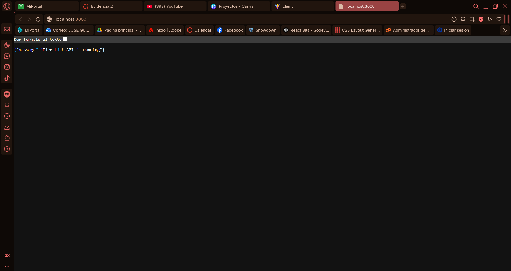
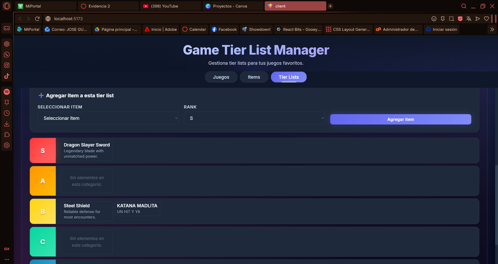

# Evidencia 2: REST API & ORM Consumption

**Estudiante:** [jose gpe rico moreno]  
**Fecha:** 8 de Noviembre, 2025  
**Proyecto:** Game Tier List Manager - REST API with Sequelize ORM

---

## 📋 Descripción del Proyecto

Aplicación full-stack que consume una REST API desarrollada con Express.js y Sequelize ORM (SQLite), mostrando la manipulación de datos en una interfaz HTML/React.

### Tecnologías Utilizadas:
- **Backend:** Node.js + Express.js + Sequelize ORM + SQLite
- **Frontend:** React 18 + TypeScript + Vite
- **API:** REST (12 endpoints CRUD)
- **Base de Datos:** SQLite con 5 tablas normalizadas (3NF)

---

## 🖥️ Captura 1: Servidores en Ejecución

**INSTRUCCIONES PARA CAPTURA:**
1. Tomar screenshot de ambas terminales mostrando:
   - Terminal 1: Backend API corriendo en 
   - Terminal 2: Frontend corriendo en 

**Evidencia:**
```
Terminal Backend:
> node src/server.js
Database synced successfully.
Server listening on http://localhost:3000

Terminal Frontend:
> npm run dev
VITE v7.1.14 ready in XXX ms
➜ Local: http://localhost:5174/
```

---

## 🌐 Captura 2: Página HTML - Tab de Juegos

**INSTRUCCIONES PARA CAPTURA:**
1. Abrir `http://localhost:5174` en el navegador
2. Verificar que esté en el tab "Juegos"
3. Mostrar el formulario de creación de juegos
4. Mostrar la lista de juegos recuperados de la API

**Elementos visibles en la página:**
- ✅ **Input para nombre del juego**
- ✅ **Textarea para descripción**
- ✅ **Botón "Crear juego"**
- ✅ **Lista de juegos** recuperados desde `/api/games` (GET request)

**Código relevante del consumo de API:**
```typescript
// GET Request - Cargar juegos desde la API
const loadGames = async () => {
  const response = await fetch(`${API_BASE_URL}/games`)
  const data: Game[] = await response.json()
  setGames(data)
}
```

---

## 📝 Captura 3: Crear un Juego (POST Request)

**INSTRUCCIONES PARA CAPTURA:**
1. Llenar el formulario con:
   - Nombre: "Dead Cells"
   - Descripción: "Roguelike metroidvania game"
2. Click en "Crear juego"
3. Mostrar el feedback de éxito
4. Verificar que el juego aparece en la lista

**Código relevante del POST:**
```typescript
// POST Request - Crear nuevo juego
const handleCreateGame = async (e: FormEvent) => {
  e.preventDefault()
  const response = await fetch(`${API_BASE_URL}/games`, {
    method: 'POST',
    headers: { 'Content-Type': 'application/json' },
    body: JSON.stringify({
      name: gameForm.name,
      description: gameForm.description
    })
  })
  const data = await response.json()
  await loadGames() // Recargar lista
}
```

---

## 🎮 Captura 4: Página HTML - Tab de Items

**INSTRUCCIONES PARA CAPTURA:**
1. Click en el tab "Items"
2. Mostrar el formulario de creación de items
3. Mostrar la lista de items recuperados de la API

**Elementos visibles:**
- ✅ **Input para nombre del item**
- ✅ **Textarea para descripción**
- ✅ **Input para URL de imagen**
- ✅ **Botón "Crear item"**
- ✅ **Lista de items** recuperados desde `/api/items` (GET request)

**Código relevante:**
```typescript
// GET Request - Cargar items
const loadItems = async () => {
  const response = await fetch(`${API_BASE_URL}/items`)
  const data: Item[] = await response.json()
  setItems(data)
}
```

---

## 🎯 Captura 5: Crear un Item (POST Request)

**INSTRUCCIONES PARA CAPTURA:**
1. Llenar el formulario con:
   - Nombre: "Electric Whip"
   - Descripción: "Fast electric weapon"
2. Click en "Crear item"
3. Mostrar el feedback de éxito y el item en la lista

---

## 📊 Captura 6: Tab de Tier Lists

**INSTRUCCIONES PARA CAPTURA:**
1. Click en el tab "Tier Lists"
2. Mostrar el formulario de creación de tier list
3. Mostrar la lista de tier lists disponibles

**Elementos visibles:**
- ✅ **Input para título**
- ✅ **Textarea para descripción**
- ✅ **Select para seleccionar juego** (datos de la API)
- ✅ **Lista de tier lists** recuperados desde `/api/tierlists` (GET request)

---

## 🏆 Captura 7: Crear Tier List (POST Request)

**INSTRUCCIONES PARA CAPTURA:**
1. Llenar el formulario:
   - Título: "Best Weapons Tier List"
   - Descripción: "Dead Cells weapon ranking"
   - Seleccionar juego: "Dead Cells"
2. Click en "Crear tier list"
3. Mostrar el tier list creado en la lista

**Código relevante:**
```typescript
// POST Request - Crear tier list
const handleCreateTierList = async (e: FormEvent) => {
  const response = await fetch(`${API_BASE_URL}/tierlists`, {
    method: 'POST',
    headers: { 'Content-Type': 'application/json' },
    body: JSON.stringify({
      title: tierListForm.title,
      description: tierListForm.description,
      gameId: tierListForm.gameId,
      userId: 1,
      isPublic: true
    })
  })
  await loadTierLists()
}
```

---

## 🎨 Captura 8: Visualizar Tier List con Items

**INSTRUCCIONES PARA CAPTURA:**
1. Click en "Ver tier list" en alguna tier list
2. Mostrar el tier grid con categorías S, A, B, C, D
3. Agregar un item a la tier list:
   - Seleccionar item del dropdown
   - Seleccionar rank (S, A, B, C, o D)
   - Click en "Agregar item"
4. Mostrar el item agregado en la categoría correspondiente

**Código relevante:**
```typescript
// GET Request - Cargar items de una tier list
const loadTierListItems = async (tierListId: number) => {
  const response = await fetch(
    `${API_BASE_URL}/tierlists/${tierListId}/items`
  )
  const data: TierListItem[] = await response.json()
  setTierListItems(data)
}

// POST Request - Agregar item a tier list
const handleAddItemToTierList = async (e: FormEvent) => {
  const response = await fetch(
    `${API_BASE_URL}/tierlists/${selectedTierList.id}/items`,
    {
      method: 'POST',
      headers: { 'Content-Type': 'application/json' },
      body: JSON.stringify({
        itemId: addItemForm.itemId,
        rank: addItemForm.rank,
        position: tierListItems.length
      })
    }
  )
  await loadTierListItems(selectedTierList.id)
}
```

---

## 🗄️ Captura 9: Base de Datos SQLite con Sequelize ORM

**INSTRUCCIONES PARA CAPTURA:**
1. Abrir el archivo `data/tierlist.db` con SQLite Browser o similar
2. Mostrar las 5 tablas:
   - `Users`
   - `Games`
   - `Items`
   - `TierLists`
   - `TierListItems`
3. Mostrar algunos registros en cada tabla

**Código del ORM (Sequelize):**
```javascript
// Modelo Game con Sequelize
const Game = sequelize.define('Game', {
  id: {
    type: DataTypes.INTEGER,
    primaryKey: true,
    autoIncrement: true
  },
  name: {
    type: DataTypes.STRING,
    allowNull: false
  },
  description: {
    type: DataTypes.TEXT,
    allowNull: true
  }
});

// Asociaciones (Relaciones 3NF)
Game.hasMany(TierList, { foreignKey: 'gameId' });
TierList.belongsTo(Game, { foreignKey: 'gameId' });
```

---

## 🔌 Captura 10: DevTools - Network Tab (API Requests)

**INSTRUCCIONES PARA CAPTURA:**
1. Abrir DevTools (F12) en el navegador
2. Ir a la pestaña "Network"
3. Filtrar por "Fetch/XHR"
4. Realizar alguna acción (crear juego, crear item, etc.)
5. Mostrar los requests HTTP:
   - `GET /api/games` - Status 200
   - `POST /api/games` - Status 201
   - `GET /api/items` - Status 200
   - `GET /api/tierlists` - Status 200

**Headers visibles:**
- ✅ **Content-Type:** application/json
- ✅ **Access-Control-Allow-Origin:** * (CORS habilitado)
- ✅ **Response Status:** 200 OK / 201 Created

---

## 📡 Captura 11: Respuesta JSON de la API

**INSTRUCCIONES PARA CAPTURA:**
1. En DevTools Network, click en un request (ej: `GET /api/games`)
2. Ir a la pestaña "Response"
3. Mostrar el JSON devuelto por la API:

```json
[
  {
    "id": 1,
    "name": "Dead Cells",
    "description": "Roguelike metroidvania game",
    "createdAt": "2025-11-08T...",
    "updatedAt": "2025-11-08T..."
  },
  {
    "id": 2,
    "name": "Hollow Knight",
    "description": "Metroidvania platformer",
    "createdAt": "2025-11-08T...",
    "updatedAt": "2025-11-08T..."
  }
]
```

---

## 🔧 Captura 12: Código Backend - API Routes

**INSTRUCCIONES PARA CAPTURA:**
1. Abrir VS Code con el archivo `src/routes.js`
2. Mostrar algunos endpoints:

```javascript
// GET all games
router.get('/games', async (req, res) => {
  const games = await Game.findAll();
  res.json(games);
});

// POST create game
router.post('/games', async (req, res) => {
  const { name, description } = req.body;
  const game = await Game.create({ name, description });
  res.status(201).json(game);
});
```

---

## 💾 Captura 13: Código ORM - Models

**INSTRUCCIONES PARA CAPTURA:**
1. Abrir el archivo `src/models/Game.js`
2. Mostrar el modelo Sequelize:

```javascript
const { DataTypes } = require('sequelize');

module.exports = (sequelize) => {
  const Game = sequelize.define('Game', {
    id: {
      type: DataTypes.INTEGER,
      primaryKey: true,
      autoIncrement: true
    },
    name: {
      type: DataTypes.STRING,
      allowNull: false
    },
    description: {
      type: DataTypes.TEXT
    }
  });
  
  return Game;
};
```

---

## 🌐 Captura 14: Código Frontend - API Consumption

**INSTRUCCIONES PARA CAPTURA:**
1. Abrir el archivo `client/src/App.tsx`
2. Mostrar las funciones de consumo de API:

```typescript
// Consumo de REST API con Fetch
const loadGames = useCallback(async () => {
  try {
    const response = await fetch(`${API_BASE_URL}/games`)
    if (!response.ok) throw new Error(`Error ${response.status}`)
    const data: Game[] = await response.json()
    setGames(data)
  } catch (err) {
    console.error('Error loading games:', err)
  }
}, [])
```

---

## ✅ Captura 15: Manipulación de Datos Completa

**INSTRUCCIONES PARA CAPTURA FINAL:**
1. Mostrar la aplicación con datos completos:
   - Al menos 2-3 juegos creados
   - Al menos 4-5 items creados
   - Al menos 1 tier list con items en diferentes categorías (S, A, B, C, D)
2. Mostrar que los inputs funcionan correctamente
3. Mostrar que los divs muestran la información de la API

**Evidencia de manipulación:**
- ✅ **CREATE:** Formularios crean nuevos registros (POST)
- ✅ **READ:** Listas muestran datos de la API (GET)
- ✅ **UPDATE:** (Implementado en backend, endpoints disponibles)
- ✅ **DELETE:** (Implementado en backend, endpoints disponibles)

---

## 📋 Lista de Endpoints REST Implementados

| Método | Endpoint | Descripción |
|--------|----------|-------------|
| GET | `/api/games` | Obtener todos los juegos |
| POST | `/api/games` | Crear nuevo juego |
| GET | `/api/items` | Obtener todos los items |
| POST | `/api/items` | Crear nuevo item |
| GET | `/api/tierlists` | Obtener todas las tier lists |
| POST | `/api/tierlists` | Crear nueva tier list |
| GET | `/api/tierlists/:id/items` | Obtener items de una tier list |
| POST | `/api/tierlists/:id/items` | Agregar item a tier list |
| GET | `/api/users` | Obtener todos los usuarios |
| POST | `/api/users` | Crear nuevo usuario |
| PUT | `/api/games/:id` | Actualizar juego |
| DELETE | `/api/games/:id` | Eliminar juego |

---

## 🎯 Conclusión

Este proyecto demuestra exitosamente:

1. ✅ **REST API funcional** con Express.js
2. ✅ **ORM Sequelize** conectado a SQLite
3. ✅ **Consumo de API** desde página HTML/React
4. ✅ **Manipulación de datos** con inputs y divs
5. ✅ **CORS configurado** para permitir el consumo desde el frontend
6. ✅ **Base de datos normalizada** (3NF) con 5 tablas relacionadas
7. ✅ **CRUD completo** implementado en backend y frontend

---

## 📚 Archivos de Referencia

- **Backend API:** `src/server.js`, `src/routes.js`
- **ORM Models:** `src/models/*.js`
- **Frontend:** `client/src/App.tsx`
- **Database:** `data/tierlist.db`
- **Documentation:** `PROJECT_DOCUMENTATION.md`, `TAREA_9_REST_API_CONSUMPTION.md`

---

**Repositorio GitHub:** https://github.com/RMJ4G27020/DATABASE-DEADCELLS-REACT

